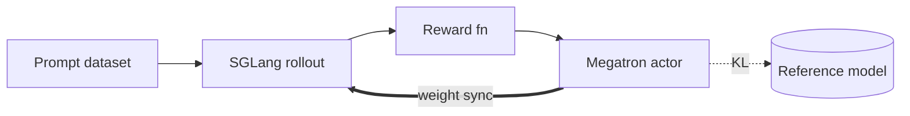

**What you need**

- A node with 8 GPUs (H100 / H200 / B-series).
- At least 500 GB of free disk.
- Docker with GPU access.

**Pre-flight checks**

```bash
# Driver up, all 8 GPUs listed?
nvidia-smi -L
# Docker can hand GPUs to a container?
docker run --rm --gpus all ubuntu nvidia-smi
# Enough free disk where Docker stores data?
df -h $(docker info -f '{{.DockerRootDir}}')
```

**What you will accomplish**

- Launch a GRPO run on Qwen3-4B and watch the reward climb!

Training a different model? The flow is the same — see [Models](/models/index) for
the per-model recipes.

## Step 1: Start the container

On the **host**:

```bash
docker pull radixark/miles:latest
docker run --rm \
  --gpus all \
  --ipc=host \
  --shm-size=32g \
  --ulimit memlock=-1 \
  --ulimit stack=67108864 \
  --network=host \
  -it radixark/miles:latest /bin/bash
```

That drops you into a shell inside the container, with Miles at `/root/miles` and
Megatron-LM at `/root/Megatron-LM`. Refresh the editable install so you run the
latest main:

```bash
cd /root/miles && git pull && pip install -e . --no-deps
```

**Everything from here on runs inside the container.**

## Step 2: Download the model and data

Three downloads:

```bash
# The model you will train
hf download Qwen/Qwen3-4B --local-dir /root/models/Qwen3-4B
# Training prompts: 17k math problems with checkable answers
hf download --repo-type dataset zhuzilin/dapo-math-17k --local-dir /root/datasets/dapo-math-17k
# Eval benchmark: harder problems, evaluated on but never trained on
hf download --repo-type dataset zhuzilin/aime-2024 --local-dir /root/datasets/aime-2024
```

## Step 3: Convert to Megatron format

Megatron reads its own sharded checkpoint format, so convert the HuggingFace
weights once:

```bash
cd /root/miles
# Load MODEL_ARGS, the Megatron-side description of the architecture
MODEL_ARGS_LINE="$(python3 miles/utils/external_utils/model_args_utils.py qwen3-4B)" || exit 1
read -ra MODEL_ARGS <<< "${MODEL_ARGS_LINE}"

# Map the HuggingFace weights into a sharded torch_dist checkpoint
PYTHONPATH=/root/Megatron-LM python tools/convert_hf_to_torch_dist.py \
   ${MODEL_ARGS[@]} \
   --hf-checkpoint /root/models/Qwen3-4B \
   --save /root/models/Qwen3-4B_torch_dist
```

Keep the original HuggingFace directory too — the rollout engines still read from
it.

## Step 4: Launch training

```bash
python scripts/run_qwen3_dense.py --model-name Qwen3-4B
```

That's it — the launcher starts a local Ray cluster and submits the training job!
A few things it already does for you:

- Checkpoints land in `/root/shared_data/checkpoints` every 20 rollouts; `--output-dir`
  moves them.
- The policy is evaluated on AIME-2024 every 20 rollouts.
- If the run dies, relaunch the same command — training resumes from the last
  checkpoint.
- The [Miles dashboard](/user-guide/dashboard) records what every GPU was doing
  during a step and what every trajectory contained, token by token. Serve it with
  `python -m miles.dashboard.serve --dump-details /root/shared_data/dump_details`
  and open `http://localhost:7788`.

Once the engines warm up and the first rollout completes, the log settles into
per-rollout metric lines (values illustrative, keys abridged):

```text
perf 0: {'perf/rollout_time': 98.6, ...}
rollout 0: {'rollout/raw_reward': 0.32, 'rollout/log_probs': -0.27, ...}
step 0: {'train/loss': 0.0021, 'train/pg_loss': 0.0018, 'train/grad_norm': 0.62, ...}
perf 0: {'perf/train_wait_time': 101.2, 'perf/actor_train_time': 41.3, ...}
```

`rollout/raw_reward` is the number to watch: the mean reward of the freshly scored
responses, drifting upward as the policy improves. You have a live RL run.

## What's happening

A Miles job combines two engines: [SGLang](https://github.com/sgl-project/sglang)
generates responses from the current policy (the *rollout*), and
[Megatron-LM](https://github.com/NVIDIA/Megatron-LM) updates the policy from those
responses (the *training*). In this recipe both share the same 8 GPUs, taking
turns.



Every iteration runs the same loop:

1. Sample a batch of prompts and let the SGLang engines generate several candidate
   responses per prompt.
2. Score every response — the reward function checks each final answer against the
   dataset label.
3. Compute the GRPO objective from the scores and step the optimizer.
4. Sync the updated weights back into the SGLang engines, and go again.

The batch-sizing knobs satisfy one identity, and Miles fills in whichever side you
leave unset:

```
rollout_batch_size × n_samples_per_prompt
  = global_batch_size × num_steps_per_rollout
```

In this recipe, 32 prompts × 8 samples = 256 = one optimizer step at global batch
size 256.

### The fine print 🔍

- **The docker flags (Step 1).** `--gpus all` exposes the GPUs, `--ipc=host` and
  `--shm-size=32g` give NCCL and Ray the shared memory they need, and
  `--network=host` lets you reach the Ray dashboard from the host.
- **`MODEL_ARGS` (Step 3).** The Megatron-side description of the architecture
  (layer count, hidden sizes, attention layout). The converter uses it to map the
  HuggingFace weights into a sharded `torch_dist` checkpoint.
- **The launcher (Step 4).** `scripts/run_qwen3_dense.py` builds the flags it passes
  to `train.py` as one group per concern (checkpoint paths, rollout, GRPO, optimizer,
  performance, eval, SGLang) and is meant to be read and edited — it is the canonical
  place to change hyperparameters. `--extra-args` appends flags without touching the
  file, and the same launcher covers Qwen3-32B and the Qwen3.5 / Qwen3.6 dense sizes
  through `--model-name`.
- **Colocation.** The recipe sets `--colocate`: four SGLang engines (2 GPUs each)
  and the Megatron trainer share the same 8 GPUs, alternating between generation
  and training. Sharing GPUs also makes the weight sync local — each rank gathers
  its shards over NCCL and hands them to its engine through IPC, no network
  involved. Disaggregated runs choose a transport with
  `--update-weight-transfer-mode`: `broadcast` (the default, over NCCL),
  [`p2p`](/advanced/p2p-weight-transfer) (point-to-point RDMA via Mooncake), or
  [`disk-delta`](/advanced/disaggregated-rollout) (versioned deltas through
  shared storage). `p2p` and `disk-delta` are incompatible with `--colocate`.
- **The reward function.** `--rm-type deepscaler` — a rule-based verifier, no
  learned reward model.
- **KL regularization.** The frozen reference model can add a KL term to the loss;
  this recipe sets `--kl-loss-coef 0.00`, so the term is off.
- **The metric lines (Step 4).** The `step` line reports each optimizer step, and
  the two `perf` lines time the generation side (`perf/rollout_time`) and the
  training side (`perf/actor_train_time`) of each iteration.

### Inspecting a run 📊

| Question | Where to look |
|---|---|
| Is the policy learning? | `rollout/raw_reward` in stdout, or wandb |
| Rollout or train bottleneck? | `perf/rollout_time` vs. `perf/actor_train_time` |
| Are GPUs saturated? | The [Miles dashboard](/user-guide/dashboard) GPU timeline |
| SGLang internals? | Ray worker logs under `~/.ray/session_latest/logs/`; raise verbosity with `--sglang-log-level` |
| Ranks crashing? | `~/.ray/session_latest/logs/worker-*.err` |

## Next steps

- [Core concepts](/user-guide/concepts) — the model behind rollout / actor / reference.
- [Launch script](/user-guide/launch-script) — what a launch script does when you run it,
  how it is structured, and the three ways to override a recipe.
- [Training backends](/user-guide/training-backend) — Megatron vs FSDP.
- [Customization](/user-guide/customization) — plug in custom rollout / reward.
- [Models](/models/index) — recipes for Qwen3.5, GLM5.2, DeepSeek V4, Kimi K2.6, and more.

If you hit issues, feel free to open an issue on [GitHub](https://github.com/radixark/miles/issues).
