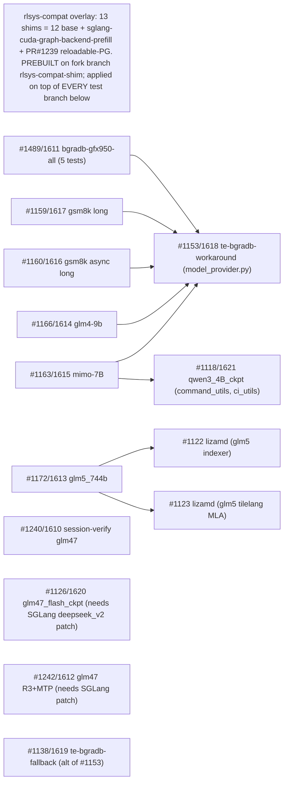

# Locally test the 12 recovered ROCm PRs on `rlsys/miles:MI350-355-latest`

## Ground rules
- **Base = `radixark/main` (`8dccb85b9`), ALREADY fetched locally** (no re-pull). This is the exact base the `rocm/*` branches were rebased onto. Do NOT use local `main` (`6d35b105d`) - that is your mi35x/codecontests **diverged** main, a 117-file different lineage that predates the upstream session refactor and would cause massive cross-lineage conflicts.
- **Build + run in a dedicated worktree** `/home/sreerohi/miles_test` (checked out off `radixark/main`), so the dirty main repo and the `miles_rebase`/`miles_qwen_harbor_pr` worktrees are untouched. Mount THAT worktree into the container.
- **NEVER push anything.** Every branch (`test/*`, `rlsys-compat`) is throwaway/local. No `git push`, no PR updates, ever.
- **Always pull the superseded (new `#161x`) PR / local `rocm/*` branch, never the old closed `#11xx/#12xx` PR.**

## Why this is non-trivial
`radixark/main` ships a newer SGLang/Python than the `rlsys` image (SGLang 0.5.9 / Py 3.10), so each test needs the **12-shim compat overlay** just to import/run. Separately, several PRs deliberately **omit shared files** that live in another PR, so real dependencies come from **actual file contents, not PR descriptions** (see "How dependencies were deduced").

## Dependency graph (derived from files each branch touches)


## Per-PR dependency table (what to pull into each test branch)
Testcase name(s) in bold first, then the PR that carries them, then extra PRs to pull. Always pull the **superseded/new** branch (local `rocm/*` = new `#161x`), never the old closed PR.

- **`test_qwen2.5_0.5B_gsm8k_short`, `test_qwen2.5_0.5B_gsm8k_async_short`, `test_sglang_config`, `test_sglang_config_mixed_offload`, `test_sglang_config_mixed_offload_ft`** — carried by `#1489/1611` (bgradb-gfx950-all) -> **+ #1153/1618**
- **`test_session_server_multi_role/test_glm47`** — carried by `#1240/1610` (session-verify) -> standalone
- **`test_mimo_7B_mtp_only_grad`** — carried by `#1163/1615` (mimo-7B) -> **+ #1118/1621 + #1153/1618**
- **`test_quick_start_glm4_9B`** — carried by `#1166/1614` (glm4-9b) -> **+ #1153/1618**
- **`test_qwen3_4B_ckpt`** — carried by `#1118/1621` -> standalone
- **`test_glm47_flash_ckpt`** — carried by `#1126/1620` -> standalone **+ SGLang `deepseek_v2.py` patch (applied in setup step 2)**
- **`test_qwen2.5_0.5B_gsm8k_async`** — carried by `#1160/1616` (gsm8k async long) -> **+ #1153/1618**
- **`test_qwen2.5_0.5B_gsm8k`** — carried by `#1159/1617` (gsm8k long) -> **+ #1153/1618**
- **`test_glm47_flash` (R3+MTP)** — carried by `#1242/1612` -> **+ SGLang `deepseek_v2.py` patch (setup step 2)**; relates to #1153 (pull #1153/1618 to be safe)
- **`test_glm5_744b_a40b_4layer`** — carried by `#1172/1613` (glm5_744b) -> **+ #1122 + #1123 (lizamd)** — DEFERRED to the very end, only on your signal
- **(no test file)** — `#1153/1618` (te-bgradb-workaround, core) -> validated transitively by the gate tests above
- **(no test file)** — `#1138/1619` (te-bgradb-fallback, core; alt of #1153) -> validated standalone (BGRADB-prone test WITHOUT the flag/#1153)

## How dependencies were deduced (why descriptions were not enough)
Dependencies come from the **actual files each branch changes** (`git diff --name-only main <branch>`), not the PR text, because in several cases the text is misleading or silent:
- **`#1489/1611`** — description *claims* it "propagates --no-gradient-accumulation-fusion ... to the bridge provider" (implying it contains `model_provider.py`). But in this chat we **dropped that commit** during rebase (duplicate of #1153). File inspection shows it touches only the 5 test files — **no `model_provider.py`** — so it hard-depends on **#1153/1618**. Text alone would have missed this.
- **`#1166/1614`** — description names **no** dependency ("add --no-gradient-accumulation-fusion gated on ROCm"). But that flag is a **no-op without #1153's provider propagation**, and the branch has no `model_provider.py`, so #1153 is required. Deduced from cross-file behavior, not the text.
- **`#1159/1617`, `#1160/1616`** — descriptions do say "Depends on #1153", but we also **dropped their `model_provider.py` commit** during rebase, so the on-disk branch truly lacks it — the pull is mandatory, not just nominal.
- **`#1163/1615`** — text names #1118 + #1153; file contents confirm the branch lacks both `command_utils.py` ROCm env handling (#1118) and `model_provider.py` (#1153).
- **`#1172/1613`** — text names #1122/#1123; file contents confirm #1172 edits only the run script while #1122/#1123 edit the `glm5/ops/*` kernels it relies on.

Rule of thumb: if a branch passes/gates `--no-gradient-accumulation-fusion` but does **not** itself contain `miles/backends/megatron_utils/model_provider.py`, it needs **#1153/1618**.

## Execution order (fastest to slowest, by est_time in seconds)
1. `#1489/1611` group (run its 5 tests, each 240-600s): `gsm8k_async_short` 240, `sglang_config_mixed_offload` 300, `gsm8k_short` 360, `sglang_config` 600, `sglang_config_mixed_offload_ft` 600
2. `#1240/1610` session-verify `test_glm47` - 400
3. `#1163/1615` mimo-7B - 420
4. `#1166/1614` glm4-9b - 600
5. `#1118/1621` qwen3_4B_ckpt - 1200
6. `#1126/1620` glm47_flash_ckpt - 2400 (requires the SGLang `deepseek_v2.py` patch from setup)
7. `#1160/1616` gsm8k async long - 5000
8. `#1159/1617` gsm8k long - 6000
9. `#1242/1612` glm47 R3+MTP - heaviest of the flow (requires the SGLang `deepseek_v2.py` patch from setup)

**DEFERRED (do LAST, only when you signal):** `#1172/1613` glm5_744b (+ `#1122`/`#1123`). 744B model, longest run; excluded from the flow above until you say go.

(est_time is a CI budget; add first-run model download+convert time on top.)

## Disk layout (this machine)
- `/` = `nvme0n1p2`, 3.5T, ~1.4T free - repo + `/tmp` + Docker storage.
- `/data` = `nvme1n1`, 3.5T, ~1.5T free - **separate disk**; put ALL big caches here.
- Risk: glm5_744b (deferred) can be ~1.5TB - watch `/data` when it runs.

## Setup (once)
0. Create the dedicated test worktree off the already-local base and confirm the base commit:
   ```
   git -C /home/sreerohi/miles worktree add /home/sreerohi/miles_test radixark/main
   git -C /home/sreerohi/miles_test rev-parse HEAD   # expect 8dccb85b9...
   ```
1. Get the compat overlay - it is PREBUILT; do NOT reconstruct it from scratch. It lives on the qwen_amd fork as branch [`rlsys-compat-shim`](https://github.com/sreerohi/miles_multi_turn_qwen_amd/tree/rlsys-compat-shim). Fetch it and derive the overlay-only commit:
   ```
   git -C /home/sreerohi/miles_test fetch qwenfork rlsys-compat-shim:rlsys-compat-shim
   git -C /home/sreerohi/miles_test branch -f rlsys-compat rlsys-compat-shim~1   # overlay commit only (top commit is just the docs)
   ```

### Why the `rlsys-compat-shim` branch exists (read before rebuilding)
   - It is the canonical, already-built compat overlay stored on the fork so the 13 shims never have to be reconstructed by hand. `rlsys-compat` = its overlay commit; the top commit only carries the plan/report under `rlsys_compat_docs/`.
   - 13 shims = 12 base shims (SGLang 0.5.9 / Py3.10 import + API compat) plus two folded in during testing:
     - `miles/backends/sglang_utils/arguments.py` - registers `--sglang-cuda-graph-backend-prefill` (default None); image SGLang 0.5.9 lacks it, but `miles_validate_args` reads it on the colocate path before `sglang_validate_args` runs. Fixes `AttributeError: ... 'sglang_cuda_graph_backend_prefill'` (surfaced by test 2).
     - `miles_plugins/megatron_bridge/__init__.py` (13th file) - upstream PR #1239 (`24b720e`): patches `megatron.bridge` `remove_non_pickleables` to drop `ReloadableProcessGroup`. Fixes `TypeError: cannot pickle 'ReloadableProcessGroup'` in `update_weights`; generic to every `--megatron-to-hf-mode bridge` weight-sync test.
   - Fallback (ONLY if the branch is unavailable): rebuild by diffing these 12 shim paths from `~/miles_qwen_harbor_pr` against `radixark/main` into one commit, then re-apply the two fixes above. 12 paths: `tito_tokenizer.py`, `test_utils/session_verify_agent.py`, `sglang_utils/sglang_engine.py`, `chat_template_utils/deepseek_v4.py`, `dumper_utils.py`, `sglang_utils/arguments.py`, `update_weight/common.py`, `update_weight/.../mixin.py`, `update_weight/.../p2p.py`, `update_weight_from_tensor.py`, `megatron_utils/actor.py`, `test_utils/mock_sglang_engine.py` (`session/core.py` gen_time intentionally excluded).
2. Launch the container (mounts the TEST worktree + all caches on `/data`; adds HF-cache + work mounts to keep `/` from filling):
   ```
   docker run -itd --name rlsys_miles \
     --device=/dev/kfd --device=/dev/dri --security-opt seccomp=unconfined \
     --group-add 44 --group-add 109 --cap-add=SYS_PTRACE --ipc=host --shm-size=32g \
     --ulimit memlock=-1 --ulimit stack=67108864 --memory=0 --memory-swap=0 \
     --privileged --ulimit nofile=65535:65535 \
     -e HF_HOME=/root/.cache/huggingface \
     -v /home/sreerohi/miles_test:/workspace/miles \
     -v /data/sreerohi/cache/models:/root/models \
     -v /data/sreerohi/cache/datasets:/root/datasets \
     -v /data/sreerohi/cache/hf:/root/.cache/huggingface \
     -v /data/sreerohi/cache/aiter:/tmp/aiter_configs \
     -v /data/sreerohi/cache/inductor:/tmp/torchinductor_root \
     -v /data/sreerohi/cache/ray:/tmp/ray \
     -v /data/sreerohi/cache/work:/root/work \
     rlsys/miles:MI350-355-latest sleep infinity
   ```
3. Apply the SGLang `deepseek_v2.py` patch inside the container (needed by #1126/#1242; NOT a miles file). Narrow the yarn condition at ~line 1138 of `/sgl-workspace/sglang/python/sglang/srt/models/deepseek_v2.py`:
   ```
   - if rope_scaling:
   + if rope_scaling and rope_scaling.get("rope_type") in ("yarn", "deepseek_yarn"):
         rope_scaling["rope_type"] = "deepseek_yarn"
   ```
   Without it, GLM-4.7-Flash crashes at model load with `KeyError: 'original_max_position_embeddings'` in aiter's `get_rope_wrapper()` (transformers v5+ auto-populates `rope_scaling` with `rope_type="default"`, so the old truthy check misclassifies it as `deepseek_yarn`).
4. (DEFERRED - only for glm5 at the very end, on your signal) Fetch lizamd deps: `git -C /home/sreerohi/miles_test fetch radixark refs/pull/1122/head:dep/1122 && git -C /home/sreerohi/miles_test fetch radixark refs/pull/1123/head:dep/1123` (rebase onto `radixark/main` if they do not merge cleanly).

## Per-test recipe (repeat for each branch, in the order above)
All git ops run in the TEST WORKTREE `/home/sreerohi/miles_test` (base `radixark/main`); never pushed:
```
cd /home/sreerohi/miles_test
git checkout -B test/<name> radixark/main
git merge --no-edit <dep-branch>...        # e.g. rocm/te-bgradb-workaround (#1153); skip if standalone
git merge --no-edit <the-PR-branch>        # e.g. rocm/bgradb-gfx950-all (#1489)
git cherry-pick rlsys-compat               # the compat overlay commit
```
Pre-flight (MANDATORY before EVERY run): clear stale processes and confirm the GPUs are idle before launching, so a leftover engine from a prior run does not OOM/contend:
```
docker exec rlsys_miles bash -lc '
  ray stop --force 2>/dev/null; pkill -9 -f train_async; pkill -9 -f sglang; pkill -9 -f ray; pkill -9 -f raylet;
  rm -rf /tmp/ray/session_* 2>/dev/null;
  sleep 5;
  echo "=== LIVE leftover procs (must be empty; zombies are OK and ignored) ===";
  ps -eo pid,stat,comm | awk "/ray|sglang|train_async/ && \$2 !~ /Z/ {print}" || true;
  echo "=== GPU use % + memory (source of truth; all must read 0) ===";
  rocm-smi --showuse --showmemuse
'
```
Gate (rocm-smi is the source of truth): launch only when every GPU shows `GPU use (%): 0` and no meaningful GPU memory in use, AND no LIVE (non-zombie) `ray`/`sglang`/`train_async` procs remain. NOTE: `ray stop --force` leaves `ray::IDLE` entries in `Z`/`<defunct>` (zombie) state because their parents (raylet/gcs_server) were killed too and nothing reaps them; zombies hold no GPU/CPU/ports and are harmless, so the check filters out `Z` state. A `ray stop` reporting "Stopped only 0 out of N ... status='zombie'" is expected and not an error. If a GPU stays >0 with a LIVE process, kill it; if >0 with no live process, wait and re-check for an orphaned kernel before launching. Zombies only clear on container restart (PID 1 is not an init-reaper); ignore them.

Then run the test DETACHED (`docker exec -d`) so it survives an SSH/agent-session drop, and record a status file on `/data` so state is discoverable on reconnect. Set `PYTHONPATH` to the repo root so `tests.ci` resolves (running a test file directly does NOT put the repo root on sys.path; CI sets `PYTHONPATH=<repo root>` itself):
```
# 1) status file (so a reconnecting user/agent knows exactly what is running)
printf 'test=%s\nbranch=%s\ncommit=%s\nfile=%s\nlog=%s\nstarted=%s\n' \
  "<name>" "$(git -C /home/sreerohi/miles_test rev-parse --abbrev-ref HEAD)" \
  "$(git -C /home/sreerohi/miles_test rev-parse --short HEAD)" "<test_file.py>" \
  "/data/sreerohi/cache/work/<name>.log" "$(date -Is)" > /data/sreerohi/current_run.txt

# 2) detached launch; process is reparented to the container, independent of the session
docker exec -d -w /workspace/miles rlsys_miles bash -lc \
  'pip install -e . --no-deps >/dev/null 2>&1; \
   PYTHONPATH=/workspace/miles python <test_file.py> > /root/work/<name>.log 2>&1; \
   echo "EXIT_CODE=$?" >> /root/work/<name>.log'
```
`-d` returns immediately and the run keeps going even if the session dies. Monitor by POLLING the log file (see Automation), never an attached shell.

Environment prerequisite (one-time per container, NOT part of the overlay): the rlsys image lacks `modelopt`, but the image's `megatron.bridge` hard-imports it (`megatron/bridge/models/gpt_provider.py: import modelopt.torch.distill`). Any test with `--megatron-to-hf-mode bridge` (all the Megatron training tests) fails at train-actor init with `ModuleNotFoundError: No module named 'modelopt'` until it is installed. Install once after the container starts:
```
docker exec rlsys_miles bash -lc 'pip install nvidia-modelopt'
```
(Environment-only; do not add to the compat overlay or edit test code. If the pip resolve conflicts with the pinned torch/deps in the image, fall back to a stub `modelopt` package exposing `modelopt.torch.distill` on PYTHONPATH.)
- WAIT: each run blocks for ~est_time + first-run model download/convert; exit 0 / assertion pass = PASS, `AssertionError`/traceback = FAIL. Only then MOVE ON.
- Record the result in the report, run cleanup, then `git checkout radixark/main` before the next.

## Per-test cleanup (keep `/data` from filling)
- On PASS: delete that test's log `/data/sreerohi/cache/work/<name>.log`, its converted checkpoint/save dirs under `/root/models` (`*_torch_dist`, `*_miles`, any `--save` dir), and stale Ray sessions `/tmp/ray/session_*`. KEEP the raw HF base download (reused across tests); prune it only under `/data` pressure.
- On FAIL: KEEP everything. In the report record the exact error line + the path to the preserved `/data/sreerohi/cache/work/<name>.log` (and any `*.failed` metrics file for session-verify).
- Between tests: `docker exec rlsys_miles bash -lc 'pkill -9 sglang; ray stop --force; pkill -9 ray'` to release GPUs.

## Report (live progress tracker)
`/data/sreerohi/rocm_pr_test_report.md` (persists on `/data`) is the single source of truth for "where are we". It has:
- A "Where we are" header: phase, `Completed X/14 (PASS/FAIL counts)`, currently-running testcase, next up, last-updated timestamp.
- A "Status board" table, one row per testcase, in run order: `| # | PR (new/old) | testcase | status | duration | notes / error+log path |`.
- Status values: `WAIT` (pending), `RUN` (running now), `PASS`, `FAIL`, `SKIP`, `DEFER`.
The board is updated at THREE points per test so a glance always shows truth: (a) flip to `RUN` + set "currently running" + put the live log path `/data/sreerohi/cache/work/<name>.log` in that row's notes when launched; (b) on finish flip to `PASS`/`FAIL` with duration; (c) bump the `Completed X/14` counter and "next up".
- RUN: notes = live log path so the user can `tail -f` progress (`docker exec rlsys_miles tail -f /root/work/<name>.log`, or host `tail -f /data/sreerohi/cache/work/<name>.log`).
- PASS: duration filled, notes = key metric (e.g. `eval/gsm8k=0.48`).
- FAIL: one-line root-cause error + kept log path `/data/sreerohi/cache/work/<name>.log`.

## Automation and monitoring (how the loop runs unattended)
Driver = a per-test loop the agent runs; each test is launched in the BACKGROUND and watched by a log monitor so a hang or a fatal traceback is caught early (no waiting out the full timeout), recorded, and the loop advances.

Per-test lifecycle:
1. Build branch (git merges + `cherry-pick rlsys-compat`) in `/home/sreerohi/miles_test`.
2. Pre-flight gate (clear procs, `rocm-smi` idle check) — must pass before launch.
3. Write `/data/sreerohi/current_run.txt` (test/branch/commit/file/log/start) and mark the row `RUN` in the report; then launch DETACHED via `docker exec -d` (see the run block above) so the run is reparented to the container and survives a session drop. Do NOT use an attached background shell for the run.
4. Monitor by POLLING the log file on `/data` (works regardless of who launched it or whether the session reconnected) for whichever trips first:
   - SUCCESS signature: `Job '.*' succeeded` and/or trailing `EXIT_CODE=0`.
   - FAIL signature (early-exit regex): `Traceback|RayTaskError|AssertionError|CalledProcessError|returned non-zero exit status|ModuleNotFoundError|ImportError|CUDA error|HIP error|HIP out of memory|torch\.OutOfMemoryError|EXIT_CODE=[1-9]`.
   - HANG guard = no-progress watchdog (NOT an absolute wall-clock cap, so long legit runs like gsm8k-long ~100min are not killed). Sample every ~30s; declare HUNG only if, for 10 CONTINUOUS minutes, BOTH: (a) the log has produced no new bytes, AND (b) `rocm-smi` shows GPU VRAM occupied (memory in use above idle) while GPU utilization is 0% on the training GPUs. That combination = allocated-but-stalled. Reset the 10-min window whenever new log output appears or GPU util goes >0%. On HUNG -> FAIL(hung).
     Watchdog sampler:
     ```
     docker exec rlsys_miles bash -lc 'rocm-smi --showuse --showmemuse --json'
     ```
     compare against the previous sample + `stat -c %s /root/work/<name>.log` (log size) each tick.
5. On terminal signal: extract the first matching root-cause line, write PASS/FAIL + duration to the report, run per-test cleanup, then advance to the next test.

On-FAIL policy = NON-BLOCKING (auto-continue): record the FAIL row (root-cause line + kept log path), run the pre-flight clear to kill leftovers, and immediately advance to the next test. Do not stop the loop; the run proceeds unattended and every failure is captured in the report for later review.

Watchdog note: because miles surfaces a training failure as `RayTaskError` -> `CalledProcessError` and the test process then exits non-zero within seconds, the exit code is the primary truth; the FAIL regex exists to (a) capture the human-readable root-cause line for the report and (b) end runs that WEDGE (ray actor stuck, VRAM held at 0% util) without exiting, so we do not burn time. On FAIL/HUNG, kill via the pre-flight clear command before the next build.

Group handling: `#1489/1611` carries 5 testcases on ONE branch — build once, then loop steps 2-5 per test file (rebuild not needed between them, but the pre-flight gate + cleanup still run between each).

## Robustness over SSH disconnect (survive + reconnect)
Everything persists independently of the session: the container is `sleep infinity`; tests run via `docker exec -d` (reparented to the container); the Ray job runs under `raylet` in the container; and all state lives on `/data` (`current_run.txt`, per-test logs, the report). So a dropped SSH/agent session does NOT kill the run.
- Container auto-restart (set once): `docker update --restart unless-stopped rlsys_miles` so a container crash brings it back automatically.
- On reconnect, these show the full picture:
  ```
  cat /data/sreerohi/rocm_pr_test_report.md          # where we are (RUN/PASS/FAIL, X/14)
  cat /data/sreerohi/current_run.txt                 # exact current test: branch/commit/file/log/start
  docker ps -a --filter name=rlsys_miles             # container up? (docker start rlsys_miles if exited)
  tail -n 40 "$(grep '^log=' /data/sreerohi/current_run.txt | cut -d= -f2)"
  grep -E "EXIT_CODE=|Job .* (succeeded|failed)|Traceback" "$(grep '^log=' /data/sreerohi/current_run.txt | cut -d= -f2)" | tail
  docker exec rlsys_miles bash -lc 'ray job list 2>/dev/null | tail'   # RUNNING/SUCCEEDED/FAILED
  ```
- Resuming the chat: the agent re-reads the report + `current_run.txt` + the current log and picks the loop back up; nothing depends on the agent's in-session memory. If the current test finished while away, its log has `EXIT_CODE=` — record PASS/FAIL and advance; if still running, keep polling; if the log is stale and GPUs idle with no live procs, treat as interrupted and re-run that test.

## Caveats
- `#1126/1620` and `#1242/1612` require the SGLang `deepseek_v2.py` yarn-condition patch applied in setup step 2 (not a miles file) — no longer blocked once that one-line fix is in the container's SGLang.
- `#1172/1613` (glm5_744b) is DEFERRED to the end and requires `#1122/#1123` (lizamd), which may need their own rebase onto `main`.
- `#1138/1619` and `#1153/1618` have no test file; #1153 is validated via the gate tests, #1138 must be exercised without the CLI-flag path.
- Merges are expected conflict-free (disjoint files); if a merge conflicts, stop and resolve before running.
- Nothing is pushed at any point; `main` here is the fork's local main, not a re-pulled upstream.